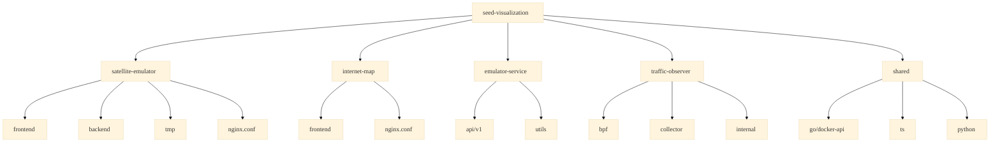
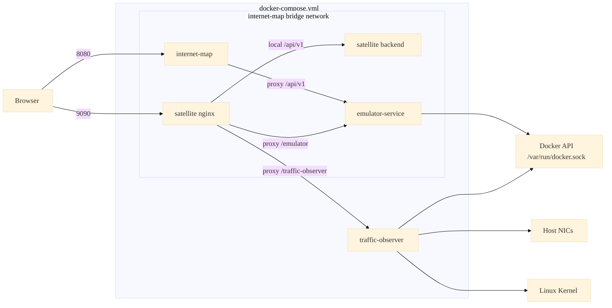
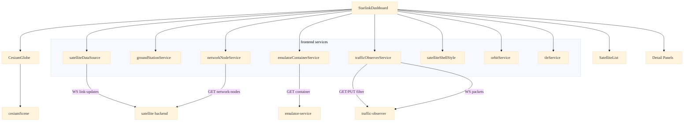
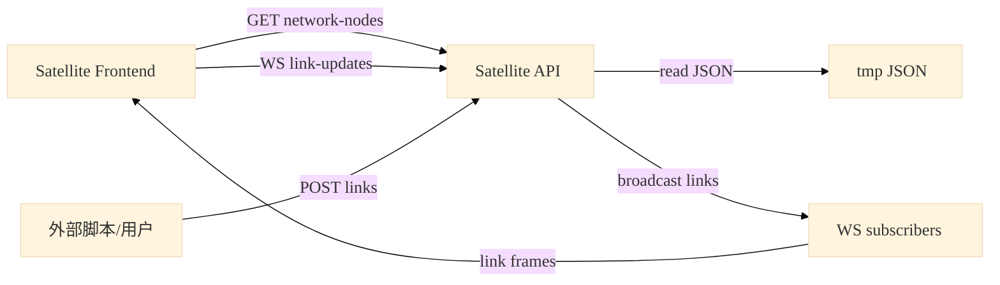
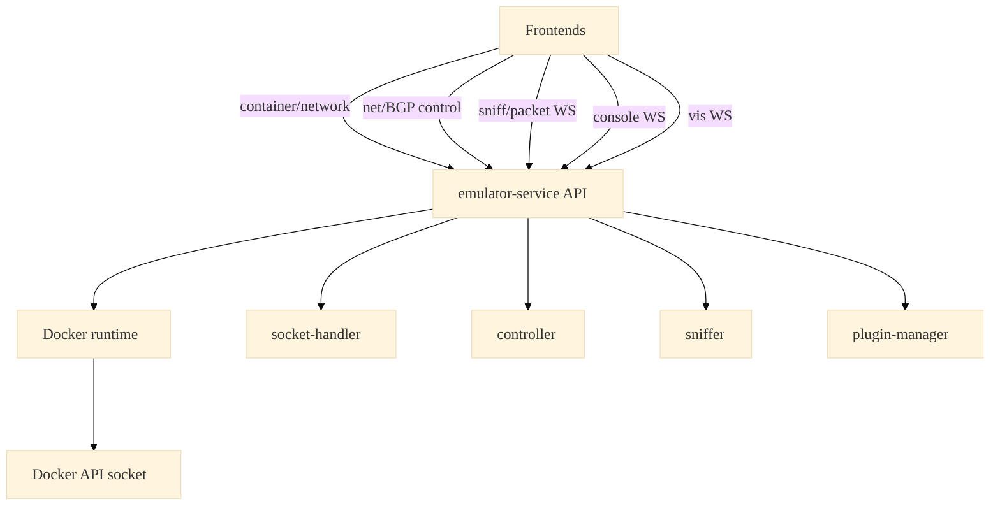
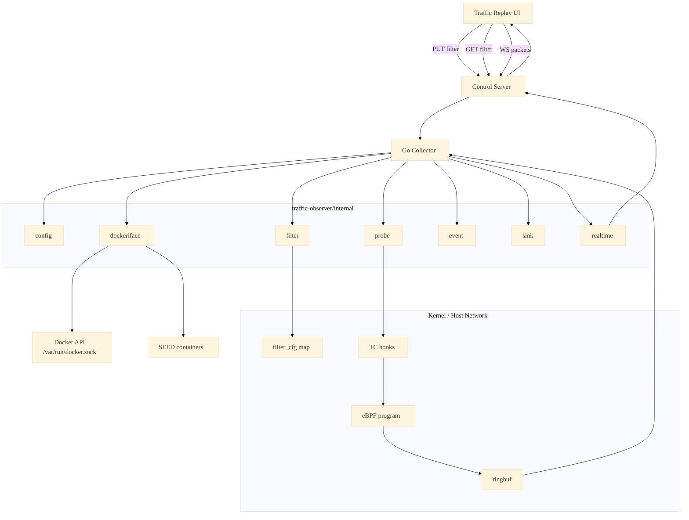
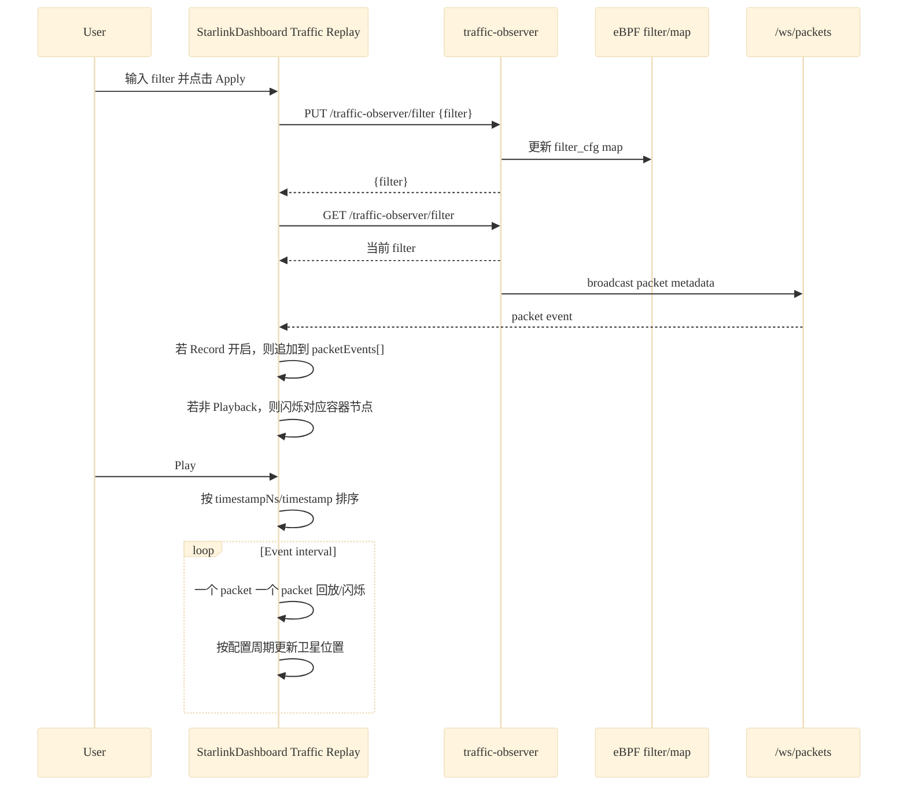
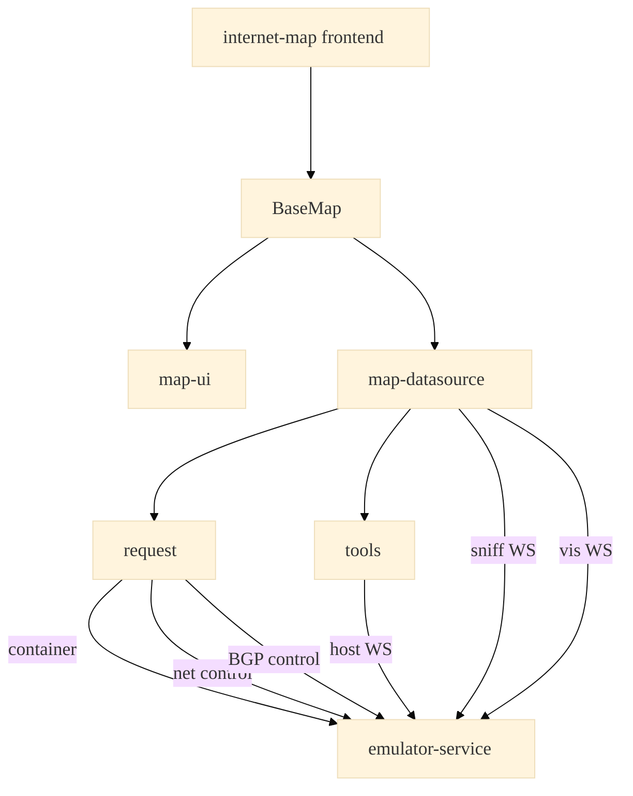

# seed-visualization 架构与模块调用关系

本文档基于当前仓库代码、`docker-compose.yml`、Nginx 配置和前后端服务入口整理，用 Mermaid.js 描述 `seed-visualization` 的整体架构与主要调用关系。

## 1. 项目模块总览

模块说明：

- `satellite-emulator/frontend`：Vue + Cesium + Element Plus，负责 3D 卫星/基站/容器节点可视化。
- `satellite-emulator/backend`：Express + WebSocket，负责卫星链路、网络路径事件广播。
- `emulator-service`：共享仿真器 API，负责 Docker 容器、网络、console、sniffer、BGP 等控制。
- `traffic-observer`：eBPF + Go Collector，负责宿主机网卡抓包、filter 控制、packet metadata 广播。
- `shared`：按语言组织共享库，目前包含 Go Docker API 封装。

## 2. Docker Compose 运行时架构

说明：

- `emulator-service` 是多个前端共享的仿真器控制 API。
- `satellite-emulator` 容器内的 Nginx 同时代理：
  - `/api/v1` 到卫星后端 `127.0.0.1:9091`
  - `/emulator/` 到 `emulator-service:7071`
  - `/traffic-observer/` 到 `traffic-observer:19092`
- `traffic-observer` 使用特权容器、host network 和 host PID，用于加载 eBPF 并 attach 到宿主机网卡。

## 3. Satellite Emulator 前端调用关系

服务说明：

- `satelliteDataSource`：订阅卫星链路 WebSocket，并按仿真时钟推进卫星位置。
- `trafficObserverService`：访问 `/traffic-observer/filter` 和 `/traffic-observer/ws/packets`。
- `emulatorContainerService`：访问 emulator-service 的 `/container`，用于把容器节点叠加到 Cesium 地球。

## 4. Satellite Backend 调用与广播关系

核心接口：

- `GET /api/v1/satellite/network-nodes`
- `POST /api/v1/satellite/links`
- `WS /api/v1/satellite/link-updates`

## 5. emulator-service 调用关系

`emulator-service` 会通过 Docker API 读取 SEED 容器，并根据容器 labels 解析 `Emulator.ParseNodeMeta()` / `Emulator.ParseNetMeta()`，只向前端返回属于当前 SEED 仿真系统的节点和网络。

## 6. traffic-observer 抓包链路

模块说明：

- `dockeriface`：通过 Docker API 和宿主机 `/sys/class/net` 建立 container 与 host veth 的映射。
- `probe`：加载 eBPF object，并把 ingress/egress 程序 attach 到目标网卡。
- `filter`：解析 tcpdump-like filter，并写入 `filter_cfg` BPF map。
- `event`：把 ringbuf 的 raw packet event 转换成前端使用的 JSON packet metadata。
- `realtime`：维护 `/ws/packets` 订阅者并广播 packet。

关键行为：

- 空 filter 表示关闭抓包。
- 非空 filter 会写入 eBPF map，非匹配包在内核侧被丢弃，不进入 ringbuf。
- Collector 会把包事件补充容器信息，例如 containerId、nodeName、nodeIp、source/dest container 信息。
- 前端 `Traffic Replay` 的 Apply 只控制后端 filter；是否记录到回放列表由前端 Record 按钮单独控制。

## 7. Traffic Replay 前端数据流

## 8. Internet Map 前端调用关系

模块说明：

- `map-datasource`：加载 `/container` 数据，订阅 sniff 与可视化更新 WebSocket。
- `map-ui`：维护节点/边样式、闪烁、回放等地图交互。
- `request`：Axios API client。

## 9. 主要调用路径汇总

| 场景 | 发起方 | 路径 | 接收方 | 作用 |
| --- | --- | --- | --- | --- |
| 卫星/基站/网络链路更新 | 外部脚本/用户 | `POST /api/v1/satellite/links` | satellite backend | 读取 tmp JSON 并广播 |
| 卫星链路订阅 | satellite frontend | `WS /api/v1/satellite/link-updates` | satellite backend | 接收 ground/satellite/network links |
| 网络节点元数据 | satellite frontend | `GET /api/v1/satellite/network-nodes` | satellite backend | 加载 host/router 位置 |
| SEED 容器列表 | satellite/internet-map frontend | `GET /emulator/api/v1/container` 或 `/api/v1/container` | emulator-service | 获取 Docker 容器和 SEED metadata |
| Internet Map 控制网络 | internet-map frontend | `POST /api/v1/container/:id/net` | emulator-service | 开关容器网络 |
| BGP 控制 | internet-map frontend | `POST /api/v1/container/:id/bgp/:peer` | emulator-service | 控制 BGP peer 状态 |
| 抓包 filter | satellite frontend | `GET/PUT /traffic-observer/filter` | traffic-observer | 获取/更新 eBPF 抓包过滤器 |
| 抓包事件订阅 | satellite frontend | `WS /traffic-observer/ws/packets` | traffic-observer | 实时接收 packet metadata |

## 10. 设计边界

- `emulator-service` 负责仿真系统容器级控制，不直接处理 Cesium 卫星渲染。
- `satellite-emulator/backend` 负责卫星链路/网络路径事件，不直接控制 Docker。
- `traffic-observer` 负责 host 网络抓包和 packet metadata，不保存 payload。
- `satellite-emulator/frontend` 负责三维可视化、Traffic Replay 录制/播放、节点闪烁与 UI 状态编排。
- `shared/` 按语言划分共享库，当前已有 Go Docker API 封装，后续可继续扩展 TS/Python 版本。
