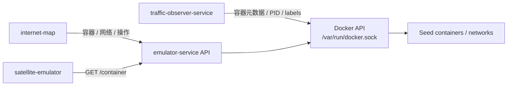

# emulator-service

`emulator-service` 是仿真器 API 总服务，负责和 Docker / Seed Emulator 节点交互，并向前端提供容器、网络、终端、sniffer、插件等通用 API。

## 职责

- 查询和过滤 Seed 容器节点。
- 获取容器、网络、网卡、会话等信息。
- 提供 Internet Map 和 Satellite 前端共用的仿真器 API。
- 为 `traffic-observer-service` 提供容器与网卡映射所需的容器元数据来源。

## 调用关系

## Docker

- 目录：`emulator-service/`
- 容器名：`emulator-service`
- 默认端口：`7071`
- 挂载：`/var/run/docker.sock`
