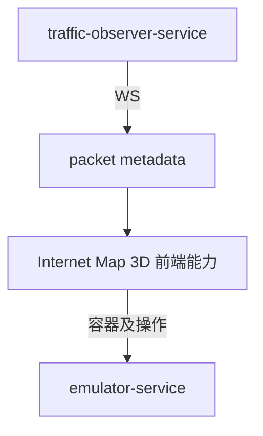

# internet-map-3D

`internet-map-3D` 表示 Internet Map 的 3D 展示方向。当前项目中没有单独的 `internet-map-3D` 容器，文档中将其作为前端能力模块描述。

## 和其它服务的关系

## 说明

- 容器操作和节点信息仍由 `emulator-service` 提供。
- 如果展示实时 packet 流动，则订阅 `traffic-observer-service` 的 packet WebSocket。
