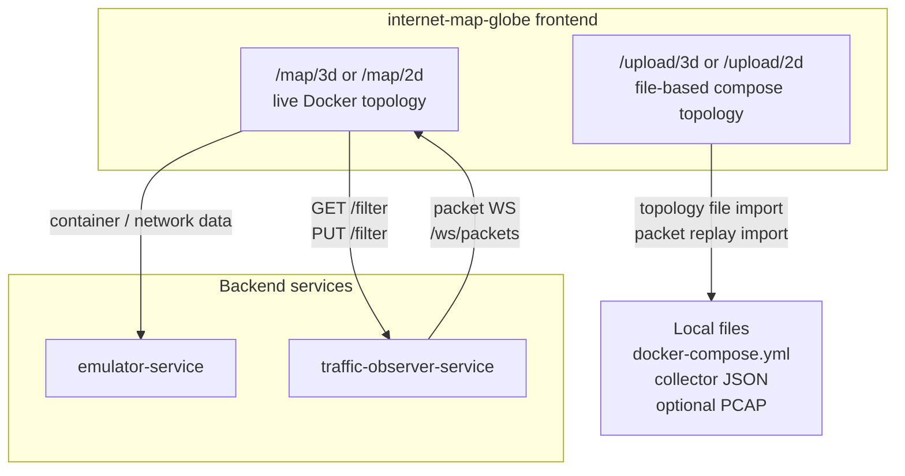
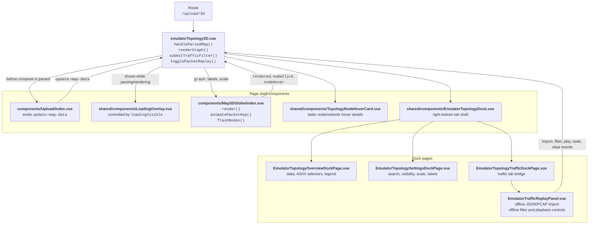
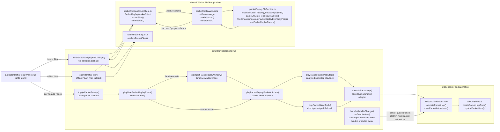
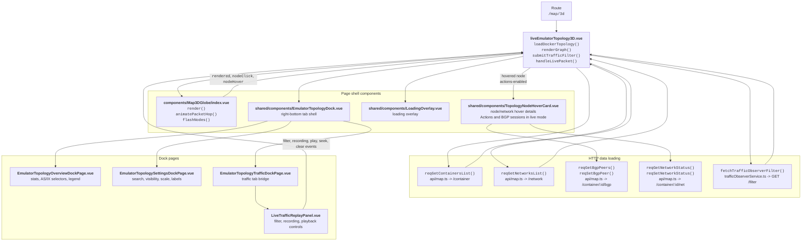
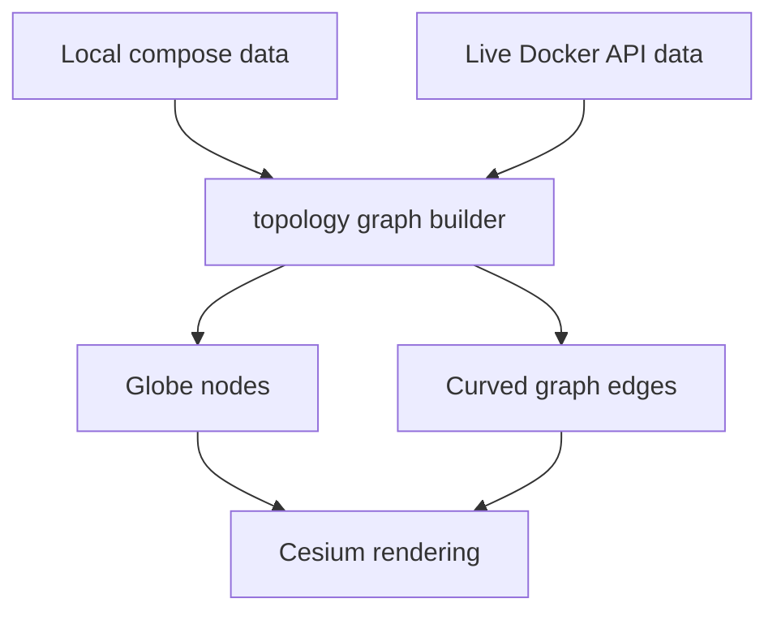
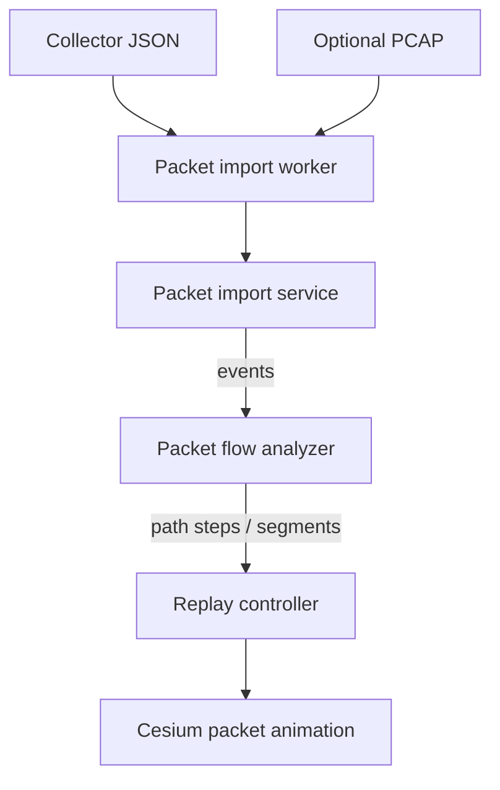
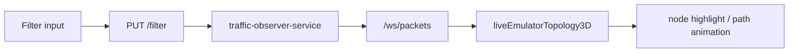

# internet-map-globe

`internet-map-globe` is the standalone Cesium emulator topology frontend. This document focuses on the live and file-based emulator topology pages:

- `/upload/3d`: file-based 3D emulator topology page backed by `emulatorTopology3D.vue`.
- `/upload/2d`: file-based 2D emulator topology page backed by `emulatorTopology2D.vue`.
- `/map/3d`: live 3D emulator topology page backed by `liveEmulatorTopology3D.vue` and Docker API data through `emulator-service`.
- `/map/2d`: live 2D emulator topology page backed by `liveEmulatorTopology2D.vue` and Docker API data through `emulator-service`.

The Docker Compose service name is `seedemu_internet_map_globe`. The default published port is `8090:80`.

## Runtime relationships



## Routes covered here

| Route | Component | Purpose |
| --- | --- | --- |
| `/upload/3d` | `view/map/emulatorTopology3D/emulatorTopology3D.vue` | 3D globe emulator topology page using local Docker Compose data. |
| `/upload/2d` | `view/map/emulatorTopology2D/emulatorTopology2D.vue` | 2D projected emulator topology page using local Docker Compose data. |
| `/map/3d` | `view/map/liveEmulatorTopology3D/liveEmulatorTopology3D.vue` | 3D globe emulator topology page using live Docker API data. |
| `/map/2d` | `view/map/liveEmulatorTopology2D/liveEmulatorTopology2D.vue` | 2D projected emulator topology page using live Docker API data. |

## Code architecture

The two emulator topology pages share the same visual shell, Cesium globe rendering path, topology controls, search behavior, packet-path filtering, and replay concepts. They are documented separately below because their data sources and traffic panels are different.

### Main source layers

| Layer | Responsibility |
| --- | --- |
| Route pages | Own page-level state, topology loading, replay state, filtering state, search state, and graph rendering orchestration. |
| Shared dock components | Own the common right-bottom dock frame and shared `Overview` / `Settings` UI. |
| Traffic replay panels | Own the page-specific replay controls. File-based topology supports packet file import; live topology supports live filter and recording. |
| Graph services | Convert emulator nodes and networks into globe nodes and curved topology edges. |
| Rendering service | Own Cesium primitives, labels, hover picking, node highlights, curved links, and packet path animations. |
| Packet services | Import saved collector data, optionally match PCAP packets, and analyze packet events into path steps. |
| Transport/API services | Talk to `emulator-service` and `traffic-observer-service`. |

Shared Vue components live under `view/map/shared/components`, shared executable graph and packet helpers live under `view/map/shared/services`, and shared type-only contracts live under `view/map/shared/types`. The file-based and live topology pages use the same `shared/services/emulatorTopologyGraph.ts` builder so node layout, grouping, search metadata, statistics, and topology edge generation stay consistent.

## `emulatorTopology3D` component and method topology

This page renders emulator topology from an uploaded Docker Compose file. The route page owns the state machine, while shared components render the globe, dock, upload entry, loading overlay, and hover card.



## `emulatorTopology3D` module and method call flow

The file-based page has two main flows: topology import/rendering and offline packet replay. The worker is used because JSON/PCAP parsing and filtering can be expensive and should not block Cesium rendering.

```mermaid
%%{init: {"flowchart": {"useMaxWidth": true, "htmlLabels": true}} }%%
flowchart LR
  Files["Local files<br/><code>docker-compose.yml</code><br/><code>collector.json</code><br/>optional <code>.pcap</code>"]

  subgraph Page["view/map/emulatorTopology3D/emulatorTopology3D.vue"]
    HandleMap["<code>handleParsedMap(value)</code><br/>accept parsed compose data"]
    RenderGraph["<code>renderGraph()</code><br/>create and display topology graph"]
    SearchFns["<code>applySearch()</code><br/><code>querySearchSuggestions()</code><br/><code>selectSearchSuggestion()</code>"]
    ImportFiles["<code>handlePacketReplayFileChange()</code><br/>read selected JSON/PCAP files"]
    SubmitFilter["<code>submitTrafficFilter()</code><br/>offline PCAP filter"]
    ReplayFns["<code>togglePacketReplay()</code><br/><code>playNextPacketReplayEvent()</code><br/><code>playPacketReplayPacketAtIndex()</code>"]
    AnimateFns["<code>animatePacketHop()</code><br/><code>playPacketDirectPath()</code>"]
  end

  subgraph SharedTopology["shared topology services"]
    ComposeTools["utils/tools.ts<br/><code>genVisData()</code><br/><code>createNodes()</code><br/><code>createNetworks()</code>"]
    GraphBuilder["shared/services/emulatorTopologyGraph.ts<br/><code>createEmulatorTopologyGraph()</code>"]
    DisplayGraph["shared/services/map3dGraph.ts<br/><code>augmentAsHighlight()</code><br/><code>waitForBrowserPaint()</code>"]
    Search["shared/services/topologySearch.ts<br/><code>buildTopologySearchSuggestions()</code><br/><code>findTopologySearchNodeIds()</code>"]
    PathFilter["shared/services/packetPathGraphFilter.ts<br/><code>filterGraphEdgesByPath()</code>"]
  end

  subgraph WorkerFlow["Browser worker import/filter flow"]
    WorkerClient["shared/services/packetReplayWorkerClient.ts<br/><code>PacketReplayWorkerClient</code><br/><code>importFiles()</code><br/><code>filterPackets()</code><br/><code>request()</code>"]
    Worker["shared/services/packetReplayWorker.ts<br/><code>self.onmessage</code><br/><code>handleImport()</code><br/><code>handleFilter()</code>"]
    FileService["shared/services/packetReplayFileService.ts<br/><code>importEmulatorTopologyPacketReplayFile()</code><br/><code>parseEmulatorTopologyPcapFile()</code><br/><code>filterEmulatorTopologyPacketReplayEventsByPcap()</code><br/><code>sortPacketReplayEvents()</code>"]
    FlowAnalyzer["shared/services/packetFlowAnalyzer.ts<br/><code>analyzePacketFlow()</code>"]
  end

  subgraph RenderFlow["Cesium render and animation flow"]
    Map3DGlobe["components/Map3DGlobe/index.vue<br/><code>render()</code><br/><code>animatePacketHop()</code><br/><code>animatePacketPath()</code><br/><code>clearPacketAnimations()</code>"]
    Scene["shared/services/cesiumScene.ts<br/><code>createMap3DScene()</code><br/><code>renderGraph()</code><br/><code>animatePacketHop()</code><br/><code>updatePacketHops()</code>"]
  end

  Files --> ComposeTools --> HandleMap --> RenderGraph
  RenderGraph --> GraphBuilder --> DisplayGraph --> Map3DGlobe --> Scene
  SearchFns --> Search --> RenderGraph
  ImportFiles --> WorkerClient
  SubmitFilter --> WorkerClient
  WorkerClient -->|"<code>new Worker(...)</code><br/><code>postMessage()</code>"| Worker
  Worker --> FileService --> Worker
  Worker -->|"success/progress/error"| WorkerClient --> ImportFiles
  ImportFiles --> FlowAnalyzer --> ReplayFns
  SubmitFilter --> FlowAnalyzer
  ReplayFns --> PathFilter --> RenderGraph
  ReplayFns --> AnimateFns --> Map3DGlobe --> Scene
```



### `emulatorTopology3D` offline replay call chain

The file-based replay page has three user-facing actions in the traffic tab: import packet files, apply an optional offline filter, and play imported packets. Expensive JSON/PCAP work is delegated to the browser Worker, while replay animation stays on the page and Cesium scene side.



| Area | File | Main methods | Called by | Purpose |
| --- | --- | --- | --- | --- |
| Compose upload | `components/Upload/index.vue` | `update:map-data` emit | `emulatorTopology3D.vue` | Provides parsed compose data to the page. |
| Topology orchestration | `view/map/emulatorTopology3D/emulatorTopology3D.vue` | `handleParsedMap`, `renderGraph`, `createDisplayGraph`, `refreshDisplayGraph` | Route page events and dock controls | Converts uploaded compose data into display state and Cesium graph props. |
| Topology graph | `shared/services/emulatorTopologyGraph.ts` | `createEmulatorTopologyGraph` | `renderGraph` | Builds IX, network, router, host nodes, AS stats, and graph edges. |
| Search | `shared/services/topologySearch.ts` | `buildTopologySearchSuggestions`, `findTopologySearchNodeIds` | `applySearch`, `querySearchSuggestions` | Finds matching graph nodes and drives highlight/orient behavior. |
| Packet worker client | `shared/services/packetReplayWorkerClient.ts` | `importFiles`, `filterPackets`, `request`, `handleMessage` | `handlePacketReplayFileChange`, `submitTrafficFilter` | Sends import/filter tasks to a Web Worker and receives progress/results. |
| Packet worker | `shared/services/packetReplayWorker.ts` | `self.onmessage`, `handleImport`, `handleFilter`, `postProgress` | `PacketReplayWorkerClient` | Parses files and filters packets off the UI thread. |
| Packet parser/filter | `shared/services/packetReplayFileService.ts` | `importEmulatorTopologyPacketReplayFile`, `parseEmulatorTopologyPcapFile`, `filterEmulatorTopologyPacketReplayEventsByPcap`, `sortPacketReplayEvents` | Worker handlers | Produces sorted replay events and PCAP-index matched subsets. |
| Flow analysis | `shared/services/packetFlowAnalyzer.ts` | `analyzePacketFlow` | Replay import/filter and playback rebuild | Groups packet events into path steps used by replay. |
| Globe wrapper | `components/Map3DGlobe/index.vue` | `render`, `animatePacketHop`, `animatePacketPath`, `flashNodes`, `clearPacketAnimations` | Page playback methods | Bridges Vue props/events to Cesium scene API. |
| Cesium scene | `shared/services/cesiumScene.ts` | `createMap3DScene`, `renderGraph`, `animatePacketHop`, `updatePacketHops` | `Map3DGlobe` | Renders nodes, labels, curved links, packet hop points, and per-frame animation. |

## `liveEmulatorTopology3D` component and method topology

This page uses live Docker API data and the traffic observer WebSocket. It shares the same globe, dock, overview, settings, and Cesium renderer as the file-based page, but uses `LiveTrafficReplayPanel.vue` and `trafficObserverService.ts` for live capture.



## `liveEmulatorTopology3D` module and method call flow

Live mode has three concurrent flows: topology loading from `emulator-service`, live filter/packet transport through `traffic-observer-service`, and Cesium animation from packet events.

```mermaid
%%{init: {"flowchart": {"useMaxWidth": true, "htmlLabels": true}} }%%
flowchart LR
  subgraph Page["view/map/liveEmulatorTopology3D/liveEmulatorTopology3D.vue"]
    LoadTopology["<code>loadDockerTopology()</code><br/>load containers/networks"]
    LoadFilter["<code>loadTrafficFilter()</code><br/>load current filter"]
    SetTopology["<code>setTopologyData()</code><br/>store Docker API data"]
    RenderGraph["<code>renderGraph()</code><br/>build display graph"]
    SubmitFilter["<code>submitTrafficFilter()</code><br/>PUT live filter"]
    HoverRuntime["shared/components/TopologyNodeHoverCard.vue<br/><code>loadRuntimeInfo()</code><br/><code>toggleBgpPeer()</code><br/><code>toggleNetworkStatus()</code><br/><code>launchConsole()</code>"]
    LivePacket["<code>handleLivePacket()</code><br/>append/queue live packet"]
    ReplayFns["<code>togglePacketReplay()</code><br/><code>playNextPacketReplayEvent()</code><br/><code>playPacketReplayPacketAtIndex()</code>"]
    FlashQueue["<code>enqueueLivePacketAnimation()</code><br/><code>flashNextLivePacketAnimation()</code><br/><code>flashLivePacketJobs()</code>"]
  end

  subgraph ApiFlow["Live topology HTTP flow"]
    ApiMap["api/map.ts<br/><code>reqGetContainersList()</code><br/><code>reqGetNetworksList()</code>"]
    RuntimeApi["api/map.ts<br/><code>reqGetBgpPeers()</code><br/><code>reqSetBgpPeer()</code><br/><code>reqGetNetworkStatus()</code><br/><code>reqSetNetworkStatus()</code>"]
    Request["utils/request.ts<br/>Axios wrapper"]
    EmulatorApi["emulator-service<br/><code>/container</code><br/><code>/network</code>"]
    RuntimeEndpoints["emulator-service<br/><code>/container/:id/bgp</code><br/><code>/container/:id/bgp/:peer</code><br/><code>/container/:id/net</code>"]
  end

  subgraph TrafficFlow["Traffic observer flow"]
    TrafficSvc["view/map/liveEmulatorTopology3D/services/trafficObserverService.ts<br/><code>fetchTrafficObserverFilter()</code><br/><code>setTrafficObserverFilter()</code>"]
    TrafficClient["<code>TrafficObserverClient</code><br/><code>connect()</code><br/><code>disconnect()</code><br/><code>scheduleReconnect()</code>"]
    ToReplayEvent["<code>toReplayEvent()</code><br/>normalize WS packet JSON"]
    Observer["traffic-observer-service<br/><code>GET /filter</code><br/><code>PUT /filter</code><br/><code>WS /ws/packets</code>"]
  end

  subgraph SharedGraph["Shared graph/search/path services"]
    GraphBuilder["shared/services/emulatorTopologyGraph.ts<br/><code>createEmulatorTopologyGraph()</code>"]
    Search["shared/services/topologySearch.ts<br/><code>buildTopologySearchSuggestions()</code><br/><code>findTopologySearchNodeIds()</code>"]
    PathFilter["shared/services/packetPathGraphFilter.ts<br/><code>filterGraphEdgesByPath()</code>"]
    FlowAnalyzer["shared/services/packetFlowAnalyzer.ts<br/><code>analyzePacketFlow()</code>"]
  end

  subgraph RenderFlow["Cesium render and animation flow"]
    Map3DGlobe["components/Map3DGlobe/index.vue<br/><code>render()</code><br/><code>animatePacketHop()</code><br/><code>flashNodes()</code>"]
    Scene["shared/services/cesiumScene.ts<br/><code>createMap3DScene()</code><br/><code>renderGraph()</code><br/><code>animatePacketHop()</code><br/><code>updatePacketHops()</code>"]
  end

  LoadTopology --> ApiMap --> Request --> EmulatorApi --> SetTopology --> RenderGraph
  HoverRuntime --> RuntimeApi
  RuntimeApi --> Request --> RuntimeEndpoints
  LoadFilter --> TrafficSvc --> Observer
  RenderGraph --> GraphBuilder --> Map3DGlobe --> Scene
  RenderGraph --> Search
  RenderGraph --> PathFilter
  SubmitFilter --> TrafficSvc --> Observer
  SubmitFilter --> TrafficClient
  TrafficClient -->|"WebSocket message"| ToReplayEvent --> LivePacket
  LivePacket --> FlowAnalyzer --> FlashQueue
  ReplayFns --> FlowAnalyzer
  ReplayFns --> PathFilter --> RenderGraph
  FlashQueue --> Map3DGlobe --> Scene
```



### `liveEmulatorTopology3D` live capture and replay call chain

The live page separates capture transport from visualization. A submitted filter starts live capture on `traffic-observer-service`; incoming WebSocket packets are normalized, remapped to the current Docker topology, analyzed into flow path segments, and queued for batched animation.

```mermaid
%%{init: {"flowchart": {"useMaxWidth": true, "htmlLabels": true}} }%%
flowchart LR
  Panel["LiveTrafficReplayPanel.vue<br/>filter / record / playback UI"]

  subgraph Page["liveEmulatorTopology3D.vue"]
    SubmitFilter["submitTrafficFilter()<br/>start / update / stop capture"]
    Connect["connectTrafficObserver()<br/>create WS client and flasher"]
    LivePacket["handleLivePacket()<br/>receive normalized packet event"]
    Remap["remapEmulatorTopologyPacketReplayEvent()<br/>match names/IPs to current topology"]
    PathUpdate["updateLiveFlowPathIfNeeded()<br/>recompute only when observation changes"]
    Prune["pruneStaleLiveFlows()<br/>remove inactive destination/flow state"]
    Reset["resetLiveFlowState()<br/>clear old path state"]
    Enqueue["enqueueLivePacketAnimation()<br/>queue highlight/path jobs"]
    BatchFlash["flashNextLivePacketAnimation()<br/>drain queue on interval"]
    FlashJobs["flashLivePacketJobs()<br/>batch node highlights and path animations"]
    VisibilityGuard["handleVisibilityChange()<br/>discard hidden-page animation state"]
    IdleReset["scheduleLiveFlowIdleReset()<br/>clear path links after idle capture"]
    Replay["togglePacketReplay()<br/>play recorded packet events"]
  end

  subgraph TrafficService["live traffic observer service"]
    FilterApi["trafficObserverService.ts<br/>fetchTrafficObserverFilter()<br/>setTrafficObserverFilter()"]
    Client["TrafficObserverClient<br/>connect()<br/>disconnect()<br/>scheduleReconnect()"]
    Normalize["toReplayEvent()<br/>normalize WS JSON"]
    Observer["traffic-observer-service<br/>GET /filter<br/>PUT /filter<br/>WS /ws/packets"]
  end

  subgraph SharedServices["shared topology and packet services"]
    FlowAnalyzer["packetFlowAnalyzer.ts<br/>analyzePacketFlow()"]
    PathFilter["packetPathGraphFilter.ts<br/>filterGraphEdgesByPath()"]
  end

  subgraph CesiumSide["globe render and animation"]
    Globe["Map3DGlobe/index.vue<br/>flashNodes()<br/>animatePacketPaths()<br/>clearPacketAnimations()"]
    Scene["cesiumScene.ts<br/>createPacketHopTrack()<br/>updatePacketHops()"]
  end

  Panel -->|"submit filter"| SubmitFilter --> FilterApi --> Observer
  SubmitFilter --> Connect --> Client --> Observer
  Observer -->|"WS packet"| Client --> Normalize --> LivePacket
  LivePacket --> Remap --> Prune
  LivePacket --> PathUpdate --> FlowAnalyzer
  FlowAnalyzer --> PathFilter
  PathUpdate --> Enqueue
  LivePacket --> Enqueue
  Enqueue --> BatchFlash --> FlashJobs --> Globe --> Scene
  VisibilityGuard --> Reset
  VisibilityGuard --> Globe
  IdleReset --> Reset
  Panel -->|"play recorded packets"| Replay --> FlowAnalyzer --> Globe
```



Live capture state guards:

| Guard | Method | Effect |
| --- | --- | --- |
| Hidden or deactivated page guard | `handleVisibilityChange`, `onDeactivated`, `onActivated`, `suspendLiveVisualization`, `resumeLiveVisualization` | Clears live animation queues, active live path state, and in-flight packet animations when the browser tab is hidden or the route component is deactivated. This prevents old animations from replaying after navigation back. |
| Idle capture guard | `scheduleLiveFlowIdleReset` | Clears live path state after packets stop arriving, so `Packet path links only` does not keep stale links. |
| Stale flow guard | `pruneStaleLiveFlows` | Removes inactive flow observations after a short TTL. This prevents a previous destination path from polluting a later destination. |
| Path-link guard | `getPathFilterNodes` in `useEmulatorTopologyGraph` options | In live mode, returns live path segments only while capture is active; when capture stops, path-only links become empty. |

| Area | File | Main methods | Called by | Purpose |
| --- | --- | --- | --- | --- |
| Live topology load | `view/map/liveEmulatorTopology3D/liveEmulatorTopology3D.vue` | `loadDockerTopology`, `setTopologyData`, `renderGraph` | Page mount and refresh action | Loads Docker API data and renders the current topology. |
| Docker API wrapper | `api/map.ts` | `reqGetContainersList`, `reqGetNetworksList`, `reqGetBgpPeers`, `reqSetBgpPeer`, `reqGetNetworkStatus`, `reqSetNetworkStatus` | `loadDockerTopology`, `TopologyNodeHoverCard.vue` | Fetches containers/networks and performs live container runtime controls through `emulator-service`. |
| Node hover runtime details | `shared/components/TopologyNodeHoverCard.vue` | `loadRuntimeInfo`, `toggleBgpPeer`, `toggleNetworkStatus`, `launchConsole` | Cesium node hover event from live page | Shows container details, BGP sessions, Launch console, Disconnect/Re-connect, and Refresh actions. |
| Live filter API | `view/map/liveEmulatorTopology3D/services/trafficObserverService.ts` | `fetchTrafficObserverFilter`, `setTrafficObserverFilter` | `loadTrafficFilter`, `submitTrafficFilter` | Reads and updates capture filter state on `traffic-observer-service`. |
| WebSocket client | `view/map/liveEmulatorTopology3D/services/trafficObserverService.ts` | `TrafficObserverClient.connect`, `disconnect`, `scheduleReconnect`, `toReplayEvent` | `submitTrafficFilter`, page lifecycle | Receives packet JSON and normalizes it to replay events. |
| Topology graph | `shared/services/emulatorTopologyGraph.ts` | `createEmulatorTopologyGraph` | `renderGraph` | Builds globe graph from live Docker container/network data. |
| Live packet handling | `liveEmulatorTopology3D.vue` | `handleLivePacket`, `enqueueLivePacketAnimation`, `flashNextLivePacketAnimation`, `flashLivePacketJobs` | `TrafficObserverClient` callback | Records packet events, analyzes paths, and queues node/link animation. |
| Flow analysis | `shared/services/packetFlowAnalyzer.ts` | `analyzePacketFlow` | Live packet handling and replay | Converts packet sequence into flow path steps. |
| Globe wrapper | `components/Map3DGlobe/index.vue` | `render`, `animatePacketHop`, `flashNodes`, `clearPacketAnimations` | Live page render/replay methods | Bridges Vue page events to Cesium scene API. |
| Cesium scene | `shared/services/cesiumScene.ts` | `createMap3DScene`, `renderGraph`, `animatePacketHop`, `updatePacketHops` | `Map3DGlobe` | Renders topology and packet animations frame by frame. |

### Dock component contract

`EmulatorTopologyDock.vue` is the shared right-bottom dock shell used by both pages.

| Component | Main responsibility | Used by |
| --- | --- | --- |
| `EmulatorTopologyDock.vue` | Shared dock frame, header, refresh button, tab switching, and traffic panel selection. | File-based and live topology pages. |
| `LoadingOverlay.vue` | Shared loading overlay and spinner used while topology rendering or refresh work is in progress. | File-based and live topology pages. |
| `EmulatorTopologyOverviewDockPage.vue` | Topology statistics, AS/IX pickers, legend, and selected-node summary. | `EmulatorTopologyDock.vue`. |
| `EmulatorTopologySettingsDockPage.vue` | Node search, visibility switches, scale slider, label switch, and hover-detail switch. | `EmulatorTopologyDock.vue`. |
| `EmulatorTopologyTrafficDockPage.vue` | Selects the file-based or live traffic panel, owns the hidden packet file input for file-based replay, and forwards traffic events back to the owning page. | `EmulatorTopologyDock.vue`. |
| `EmulatorTrafficReplayPanel.vue` | Offline replay controls, collector JSON import, optional PCAP import, and offline filtering. | File-based topology page through `EmulatorTopologyTrafficDockPage.vue`. |
| `LiveTrafficReplayPanel.vue` | Live filter, packet recording, and live replay controls. | Live topology page through `EmulatorTopologyTrafficDockPage.vue`. |
| `Upload.vue` | Provides the Docker Compose file import control shown before the file-based topology is rendered. It is not the globe renderer. | `emulatorTopology3D.vue`. |
| `Map3DGlobe` | Hosts the Cesium globe after file-based data is parsed, and is also used directly by the live topology page. | `emulatorTopology3D.vue` and `liveEmulatorTopology3D.vue`. |

## External call matrix

| Caller | Module | Target | Purpose |
| --- | --- | --- | --- |
| `liveEmulatorTopology3D.vue` | `api/map.ts` -> `utils/request.ts` | `emulator-service /container` | Load live emulator containers. |
| `liveEmulatorTopology3D.vue` | `api/map.ts` -> `utils/request.ts` | `emulator-service /network` | Load live emulator networks. |
| `TopologyNodeHoverCard.vue` | `api/map.ts` -> `utils/request.ts` | `emulator-service /container/:id/bgp` | Load live router BGP sessions. |
| `TopologyNodeHoverCard.vue` | `api/map.ts` -> `utils/request.ts` | `emulator-service /container/:id/bgp/:peer` | Enable or disable one BGP peer. |
| `TopologyNodeHoverCard.vue` | `api/map.ts` -> `utils/request.ts` | `emulator-service /container/:id/net` | Read or update container network connectivity. |
| `TopologyNodeHoverCard.vue` | `utils/window-manager.ts` | iframe `/console#<container-id>` inside current page | Launch container console in the globe page, consistent with `internet-map`. |
| `liveEmulatorTopology3D.vue` | live traffic observer service | `traffic-observer-service GET /filter` | Load current capture filter. |
| `liveEmulatorTopology3D.vue` | live traffic observer service | `traffic-observer-service PUT /filter` | Start, update, or stop live capture. |
| `liveEmulatorTopology3D.vue` | live traffic observer client | `traffic-observer-service WS /ws/packets` | Receive live packet messages. |
| `emulatorTopology3D.vue` | packet replay worker client | Browser Worker | Import collector JSON and optional PCAP without blocking the UI thread. |
| `emulatorTopology3D.vue` | packet replay worker client | Browser Worker | Apply offline PCAP filtering and map matched PCAP indexes back to collector JSON events. |

## Page call flow summary

`emulatorTopology3D.vue` uses a local Docker Compose file as the topology source. Packet replay data comes from collector JSON and optional PCAP files.

1. User selects `docker-compose.yml` through `Upload.vue`.
2. Compose conversion tools normalize emulator metadata into nodes and networks.
3. The shared topology graph builder creates globe nodes and curved graph edges.
4. User optionally imports collector JSON and a matching PCAP.
5. The packet replay worker imports JSON/PCAP, filters PCAP packets when requested, and keeps JSON-to-PCAP index alignment.
6. The packet flow analyzer builds replay path steps.
7. The globe component and Cesium renderer display node highlights and packet path animation.

`liveEmulatorTopology3D.vue` uses Docker API data from `emulator-service` as the topology source. Live packets come from `traffic-observer-service`.

1. Page loads live containers and networks from `emulator-service`.
2. The shared topology graph builder creates the current globe graph.
3. User submits a capture filter.
4. The live traffic observer service sends `PUT /filter` to `traffic-observer-service`.
5. The live traffic observer client opens `/ws/packets`.
6. Incoming packets are recorded when recording is enabled.
7. Packets are analyzed into path steps and queued for Cesium node highlights or packet path animation.
8. Idle capture clears live packet path state so `Packet path links only` does not keep stale links.

## Topology graph model

The file-based and live pages use the same conceptual graph model.



Node rendering rules:

| Emulator object | Shape | Notes |
| --- | --- | --- |
| IX network | Star | `netInfo.type == "global"`. |
| Ordinary network | Diamond-like network marker | Hidden when the network visibility switch is off. When hidden, all topology links are hidden too. |
| Router / BorderRouter | Dot | Group color is based on AS/group. |
| Host | Hexagon | Group color is based on AS/group. |

Positioning rules:

- Explicit `org.seedsecuritylabs.seedemu.meta.geo.lat` and `org.seedsecuritylabs.seedemu.meta.geo.lon` metadata is respected.
- IX/router/host nodes with metadata coordinates are fixed to those coordinates.
- Ordinary networks without coordinates are placed near the midpoint of connected endpoint nodes.
- Containers without coordinates are placed near their parent network or AS anchor with deterministic offsets.
- Large topologies rely on node scaling, label switches, search highlighting, and optional packet-link-only filtering.

## Packet replay and capture



### Offline import

The offline import path is used by `emulatorTopology3D`.

Supported packet files:

- Collector JSON.
- Classic `.pcap` used together with collector JSON.

Current PCAP limitations:

- Supports classic PCAP, not PCAPNG.
- Supports Ethernet + IPv4 parsing.
- Parses TCP/UDP source and destination ports.
- Recognizes common protocol numbers such as ICMP, TCP, UDP, GRE, ICMPv6, and SCTP.
- Does not fully parse VLAN, Linux cooked capture, IPv6 payloads, GRE/VXLAN inner packets, or Wireshark-level protocol details.

Offline filter examples:

```text
icmp
tcp port 80
udp
host 10.150.0.71
src host 10.150.0.71
dst host 10.151.0.71
src port 1234
dst port 80
ip proto 47
proto gre
```

Unsupported tcpdump-like shorthand such as `src 10.150.0.71` is intentionally treated as invalid syntax. Use `src host 10.150.0.71` instead.

### Live capture

The live capture path is used by `liveEmulatorTopology3D`.



Live packet messages are expected to include the compact fields emitted by `traffic-observer-service`, including:

- `type`
- `timestamp`
- `timestampNs`
- `containerName`
- `ifName`
- `nodeLabel`
- `nodeName`
- `nodeIp`
- `networkId`
- `networkName`
- `networkLabel`
- `sourceIp`
- `destIp`
- `ipProtocol`
- `sourceContainerName`
- `sourceNodeName`
- `sourceNodeIp`
- `destContainerName`
- `destNodeName`
- `destNodeIp`

The frontend uses container names and node/network labels as stable identifiers when file-based or live data does not have stable Docker container IDs.

## Playback timing modes

The emulator topology replay panels support two mutually exclusive timing modes.

| Mode | Behavior |
| --- | --- |
| `Interval` | Sorts packets by timestamp and plays them one by one with a fixed `Event interval (ms)`. |
| `Timeline`, `Time window (ms) > 0` | Sorts packets by timestamp, groups packets into time windows, and can animate packets inside the same window in parallel. `Timeline speed` scales real timestamp offsets inside each window and window progression. |
| `Timeline`, `Time window (ms) = 0` | Disables window grouping and plays packets one by one using real timestamp gaps divided by `Timeline speed`. |

## Environment variables

The frontend reads environment files from `internet-map-globe/frontend/env`.

| Variable | Used by | Description |
| --- | --- | --- |
| `VITE_FRONTEND_URL_PREFIX` | router | Base route prefix. |
| `VITE_SERVER_URL_PREFIX` | API helpers | Main frontend API prefix. |
| `VITE_SERVER_EMULATOR_URL_PREFIX` | Docker/emulator data | Proxied emulator service API prefix. |
| `VITE_PROXY_EMULATOR_ADDRESS` | development only | Emulator service target for Vite dev proxy. |
| `VITE_TRAFFIC_OBSERVER_URL_PREFIX` | traffic observer proxy | Preferred traffic observer prefix, for example `/traffic-observer`. |
| `VITE_TRAFFIC_OBSERVER_ADDRESS` | development only | Traffic observer target for Vite dev proxy. |
| `VITE_TRAFFIC_OBSERVER_WS_URL` | fallback | Optional explicit packet WebSocket URL. |
| `VITE_TRAFFIC_OBSERVER_FILTER_URL` | fallback | Optional explicit filter API URL. |
| `VITE_SATELLITE_TILES_URL` | Cesium scene | Tile URL used for the globe base imagery. |

Production normally relies on Nginx routing with `VITE_TRAFFIC_OBSERVER_URL_PREFIX=/traffic-observer`. Development can use `VITE_TRAFFIC_OBSERVER_ADDRESS=http://<host>:19092` so Vite proxies `/traffic-observer` to `traffic-observer-service`.

## Docker and Nginx

Important files:

- `internet-map-globe/Dockerfile`
- `internet-map-globe/nginx.conf`
- `internet-map-globe/entrypoint.sh`

The container serves the built frontend through Nginx. In the root Docker Compose configuration, it should be exposed as:

```yaml
ports:
  - "8090:80"
```

## Tests

The frontend package scripts are:

```bash
pnpm run lint
pnpm run build
pnpm run build-test
pnpm run test:unit
pnpm run test:e2e
```

Current test coverage documentation is maintained in:

- [internet-map-globe-testing.md](./test/internet-map-globe-testing.md)

## Notes for maintainers

- Keep `emulatorTopology3D` and `liveEmulatorTopology3D` behavior aligned when changing shared topology controls.
- Do not add file-only behavior to `liveEmulatorTopology3D`; live topology data comes from Docker API.
- Do not add live filter capture to file-based topology without a clear mapping between file-based topology nodes and live Docker containers.
- Keep long-running import/parsing work inside a Web Worker when it can block the UI.
- Preserve JSON-to-PCAP packet index alignment by keeping the original JSON order for offline PCAP filtering and sorting only the playback list.


