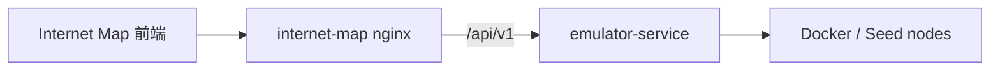

# internet-map

`internet-map` 是传统 Internet Map 前端，用于展示和操作 Seed Emulator 中的网络、节点、IX、Transit 等拓扑。

## 当前结构

- 目录：`internet-map/`
- 前端：`internet-map/frontend/`
- 容器名：`internet-map`

## 调用关系

## 说明

Internet Map 不再包含独立 backend。所有通用仿真器 API 统一走 `emulator-service`。
