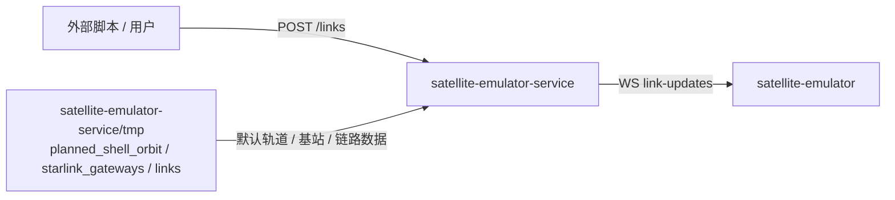

# satellite-emulator-service

`satellite-emulator-service` 是 `satellite-emulator` 独立服务。

## 职责

- 接收卫星链路、基站链路更新。
- 通过 WebSocket 向 Satellite 前端广播链路帧。
- 读取 `satellite-emulator-service/tmp` 下的 JSON 数据作为默认数据源。

## 接口

| 接口 | 说明 |
| --- | --- |
| `POST /api/v1/satellite/links` | 提交 satellite 链路帧 |
| `GET /api/v1/satellite/planned-shell-orbit` | 获取规划轨道数据 |
| `GET /api/v1/satellite/starlink-gateways` | 获取 Starlink gateway / ground station 数据 |
| `WS /api/v1/satellite/link-updates` | 前端订阅链路更新 |

## 调用关系

## 测试覆盖

Mermaid 测试覆盖图见 [satellite-emulator-service-testing.md](./test/satellite-emulator-service-testing.md)。
