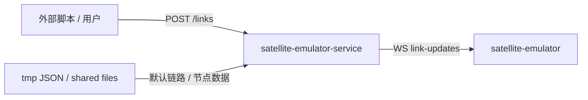

# satellite-emulator-service

`satellite-emulator-service` 是 `satellite-emulator` 独立服务。

## 职责

- 接收卫星链路、基站链路、网络路径更新。
- 通过 WebSocket 向 Satellite 前端广播链路帧。
- 读取 `tmp` 下的 JSON 数据作为默认数据源。

## 接口

| 接口 | 说明 |
| --- | --- |
| `POST /api/v1/satellite/links` | 提交 satellite 或 network 类型链路帧 |
| `GET /api/v1/satellite/network-nodes` | 获取 host/router 等网络节点位置 |
| `WS /api/v1/satellite/link-updates` | 前端订阅链路更新 |

## 调用关系

