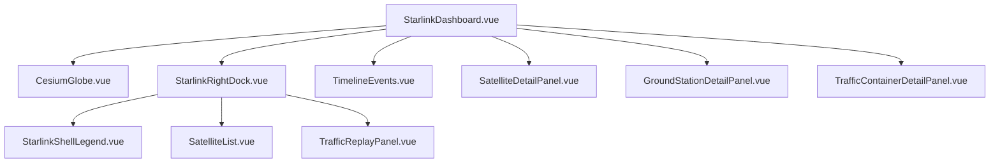
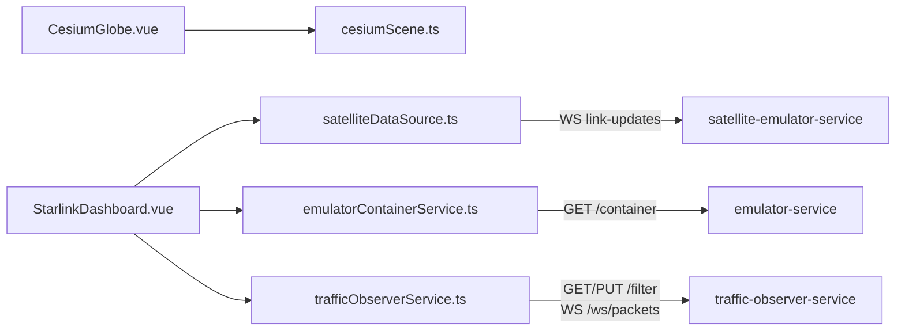

# satellite-emulator

`satellite-emulator` 现在只负责 Satellite 前端和 Nginx 代理。

## 职责

- 构建并托管 Satellite 3D 前端。
- 通过 Nginx 代理：
  - `/api/v1` 到 `satellite-emulator-service:9091`
  - `/emulator/` 到 `emulator-service:7071`
  - `/traffic-observer/` 到 `host.docker.internal:19092`

## 组件拓扑

## Service / API 调用

