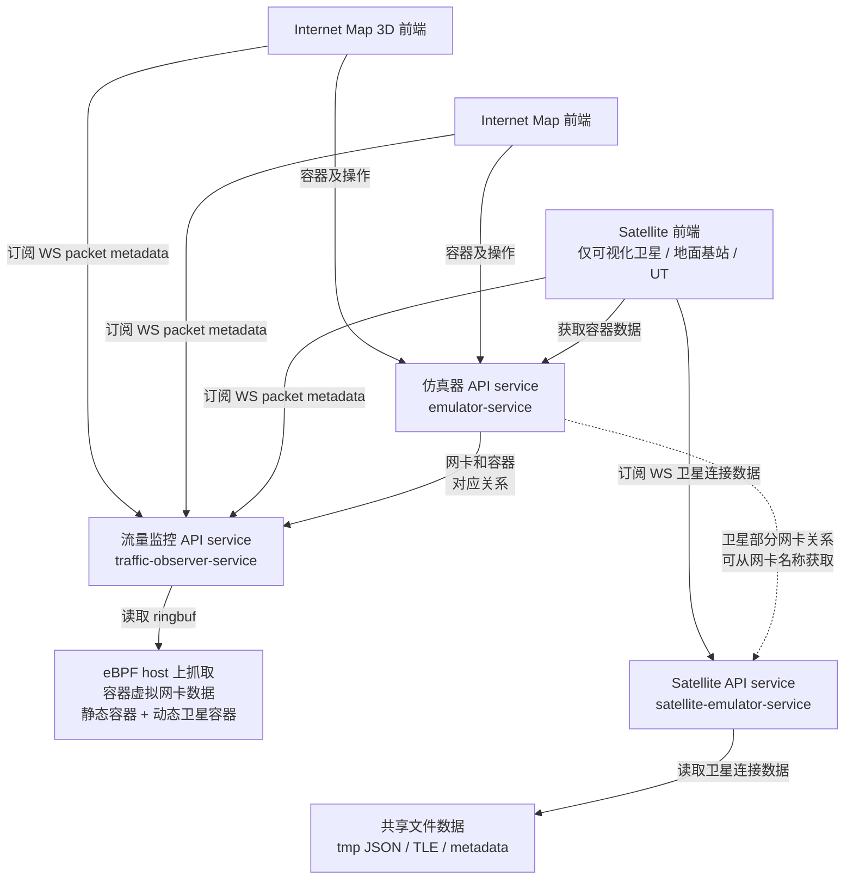

# seed-visualization 项目总览

seed-visualization 目前由 5 个主要容器组成：

- `internet-map`：Internet Map 前端。
- `satellite-emulator`：Satellite 3D 可视化前端和 Nginx 入口。
- `satellite-emulator-service`：卫星链路、基站链路、网络路径事件 API / WebSocket 服务。
- `traffic-observer-service`：eBPF + Go Collector，负责抓取宿主机容器虚拟网卡上的 packet metadata。
- `emulator-service`：仿真器 API 总服务，负责容器、网络、终端、sniffer、插件等通用能力。

## 子项目目录

| 子项目 / 能力 | 目录 | 简介 | 文档 |
| --- | --- | --- | --- |
| `internet-map` | `internet-map/` | Internet Map 前端，用于展示传统网络拓扑、IX / Transit / AS 节点，并提供容器操作入口。 | [internet-map.md](./internet-map.md) |
| `internet-map-3D` | `internet-map/` | Internet Map 的 3D 展示方向，目前作为前端能力描述，不是独立容器。 | [internet-map-3D.md](./internet-map-3D.md) |
| `satellite-emulator` | `satellite-emulator/` | Satellite 3D 前端与 Nginx 入口，负责卫星、地面基站、容器节点、链路与抓包回放展示。 | [satellite-emulator.md](./satellite-emulator.md) |
| `satellite-emulator-service` | `satellite-emulator-service/` | Satellite API / WebSocket 服务，负责链路帧、网络路径、网络节点元数据。 | [satellite-emulator-service.md](./satellite-emulator-service.md) |
| `traffic-observer-service` | `traffic-observer-service/` | eBPF + Go Collector 服务，负责抓包 filter、ringbuf 读取和 packet metadata WS 推送。 | [traffic-observer-service.md](./traffic-observer-service.md) |
| `emulator-service` | `emulator-service/` | 仿真器 API 总服务，负责 Docker 容器、网络、终端、sniffer、插件等通用能力。 | [emulator-service.md](./emulator-service.md) |
| `shared` | `shared/` | 跨语言共享库目录，目前包含 Go 版 Docker API 封装，后续可扩展 TS / Python 等版本。 | - |

## 总览结构图

## 容器与职责

| 容器 | 目录 | 主要职责 |
| --- | --- | --- |
| `internet-map` | `internet-map/` | Internet Map 前端、传统网络拓扑展示、容器操作入口 |
| `satellite-emulator` | `satellite-emulator/` | Satellite 3D 前端、Nginx 代理 `/api/v1`、`/emulator`、`/traffic-observer` |
| `satellite-emulator-service` | `satellite-emulator-service/` | `POST /links`、`GET network-nodes`、`WS link-updates` |
| `traffic-observer-service` | `traffic-observer-service/` | eBPF loader、ringbuf reader、filter control、packet WebSocket |
| `emulator-service` | `emulator-service/` | 容器、网络、终端、sniffer、插件等仿真器 API |

> `traffic-observer-service` 使用 `network_mode: host`，因此 `satellite-emulator` 的 Nginx 通过 `host.docker.internal:19092` 访问它，而不是通过 compose service DNS。

## Docker Compose 服务

当前 compose 中期望保留以下服务：

- `internet-map`
- `satellite-emulator`
- `satellite-emulator-service`
- `traffic-observer-service`
- `emulator-service`

前端访问路径：

- Internet Map：`http://localhost:8080`
- Satellite Emulator：`http://localhost:9090`
- emulator-service API：`http://localhost:7071`
- satellite-emulator-service API：`http://localhost:9091`
- traffic-observer-service control / WS：`http://localhost:19092`
