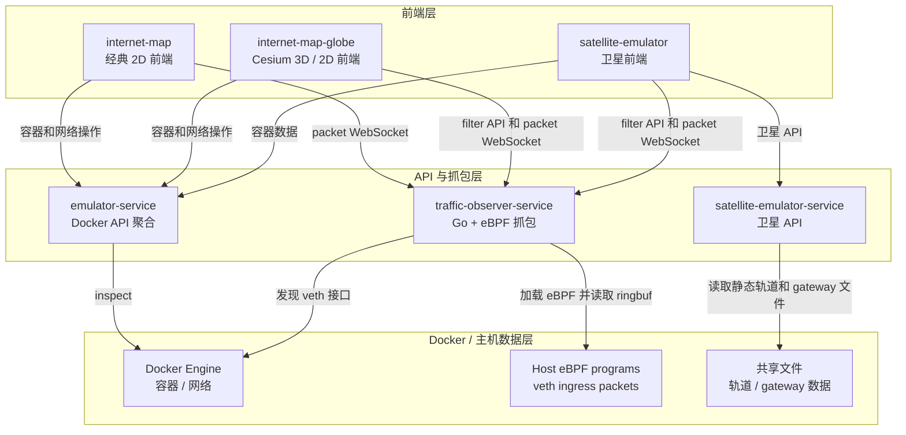

# seed-visualization 项目总览

`seed-visualization` 由多个相对独立的前端和后端服务组成，并通过根目录 `docker-compose.yml` 统一启动。

## 子项目

| 项目 | 目录 | 作用 | 文档 | 测试文档 |
| --- | --- | --- | --- | --- |
| `internet-map` | `internet-map/` | 经典 2D Internet Map 前端，包含传统拓扑、IX、Transit、Dashboard、Plugin、Console 等页面。 | [internet-map.md](./internet-map.md) | [internet-map-testing.md](./test/internet-map-testing.md) |
| `internet-map-globe` | `internet-map-globe/` | Cesium 拓扑前端，包含 3D 地球和 2D 平铺地图，支持实时 Docker API 数据和上传文件数据。 | [internet-map-globe.md](./internet-map-globe.md) | [internet-map-globe-testing.md](./test/internet-map-globe-testing.md) |
| `satellite-emulator` | `satellite-emulator/` | 卫星可视化前端和 Nginx 入口，展示卫星、地面站、链路、容器叠加和流量回放。 | [satellite-emulator.md](./satellite-emulator.md) | [satellite-emulator-testing.md](./test/satellite-emulator-testing.md) |
| `satellite-emulator-service` | `satellite-emulator-service/` | 卫星 API 服务，提供轨道、gateway、卫星链路等数据。 | [satellite-emulator-service.md](./satellite-emulator-service.md) | [satellite-emulator-service-testing.md](./test/satellite-emulator-service-testing.md) |
| `traffic-observer-service` | `traffic-observer-service/` | Go + eBPF 抓包服务，提供 filter 控制、packet WebSocket，以及可选 PCAP / JSON 记录。 | [traffic-observer-service.md](./traffic-observer-service.md) | [traffic-observer-service-testing.md](./test/traffic-observer-service-testing.md) |
| `emulator-service` | `emulator-service/` | 仿真器 API 聚合服务，封装 Docker 容器、网络、终端、sniffer、插件等能力。 | [emulator-service.md](./emulator-service.md) | [emulator-service-testing.md](./test/emulator-service-testing.md) |
| `shared` | `shared/` | 跨服务共享代码，目前包含 Go 版 Docker API 封装。 | - | 由引用它的服务测试覆盖。 |

## 运行时关系

## Docker Compose 服务名

根目录 `docker-compose.yml` 当前包含以下 service key：

- `seedemu_emulator_service`
- `seedemu_internet_map`
- `seedemu_internet_map_globe`
- `seedemu_satellite_emulator`
- `seedemu_satellite_emulator_service`
- `seedmu_traffic_observer_service`

默认端口：

- Internet Map：`http://localhost:8080`
- Internet Map Globe：`http://localhost:8090`
- Satellite Emulator：`http://localhost:9090`
- emulator-service API：`http://localhost:7071`
- satellite-emulator-service API：`http://localhost:9091`
- traffic-observer-service control / WebSocket：`http://localhost:19092`

## 项目文档

- [internet-map](./internet-map.md)
- [internet-map-globe](./internet-map-globe.md)
- [satellite-emulator](./satellite-emulator.md)
- [satellite-emulator-service](./satellite-emulator-service.md)
- [traffic-observer-service](./traffic-observer-service.md)
- [emulator-service](./emulator-service.md)
