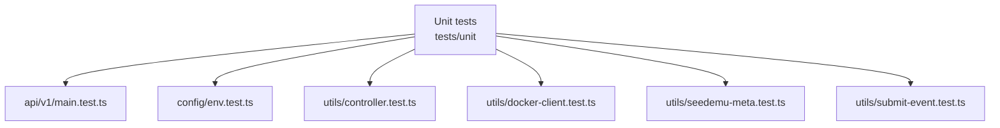
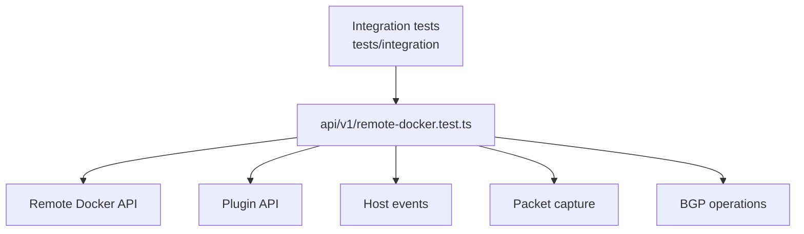

# emulator-service 测试覆盖文档

本文档描述 `emulator-service` 当前测试用例覆盖的模块和测试函数。

## 测试入口

- 单元测试：`npm run test:unit`
- 集成测试：`npm run test:integration`

## 单元测试覆盖图

| 测试文件 | 覆盖模块 | 测试函数 |
| --- | --- | --- |
| `tests/unit/api/v1/main.test.ts` | API v1 router | `returns seed containers and filters non-seed containers` `returns a sanitized server error when docker listContainers fails` `returns a structured response for unknown API routes` `returns parameter error when a container id has no unique match` `returns network metadata from docker networks` `returns docker-controlled network status for a matched container` `passes body params to network status changes` `returns details for a uniquely matched container id prefix` `rejects container operations when an id prefix is ambiguous` `lists BGP peers for a uniquely matched container` `passes requested BGP peer state changes to the controller` `stores and returns the active sniff filter` `returns parameter error for packet capture without node id or name` `starts packet capture by node name and returns the packet filter` |
| `tests/unit/config/env.test.ts` | Environment loader | `loads development env by default` `loads development env while running under Jest NODE_ENV=test` `loads production env when BACKEND_ENV is production` `keeps real environment variables over file values` `configures the checked-in development Docker endpoint` |
| `tests/unit/utils/controller.test.ts` | Controller service | `maps net_status output to a boolean` `parses BGP peer rows from bird output` |
| `tests/unit/utils/docker-client.test.ts` | Docker client configuration | `uses the local Docker daemon by default` `uses DOCKER_HOST and DOCKER_PORT for remote Docker daemons` `parses tcp Docker host URLs` `parses http and https Docker host URLs` `uses socket paths when configured` |
| `tests/unit/utils/seedemu-meta.test.ts` | SEED metadata parser | `parses container node metadata labels` `parses network metadata labels` |
| `tests/unit/utils/submit-event.test.ts` | SubmitEvent runtime interactions | `executes a command inside a node through the runtime client` `raises runtime execution failures to callers` |

## 集成测试覆盖图

| 测试文件 | 覆盖模块 | 测试函数 |
| --- | --- | --- |
| `tests/integration/api/v1/remote-docker.test.ts` | Remote Docker API | `returns runtime frontend environment` `requests containers from the configured remote Docker daemon` `requests networks from the configured remote Docker daemon` `requests a specific container from the configured remote Docker daemon` `returns an error when a requested container does not exist` `returns an error for network status when the container id is invalid` `does not change network status when the container id is invalid` |
| `tests/integration/api/v1/remote-docker.test.ts` | Plugin API | `returns configured plugin list` `rejects unknown plugin install requests after querying the remote containers` `accepts unknown plugin uninstall requests without touching container files` |
| `tests/integration/api/v1/remote-docker.test.ts` | Host event API | `broadcasts visualization changes for a real remote Docker container` `broadcasts host events through the API endpoint` |
| `tests/integration/api/v1/remote-docker.test.ts` | Sniffer / packet capture | `returns the current sniffer filter` `returns an error for packet capture when the target node does not exist` |
| `tests/integration/api/v1/remote-docker.test.ts` | BGP operations | `returns an error for BGP peer listing when the container id is invalid` `does not change BGP peer state when the container id is invalid` |

