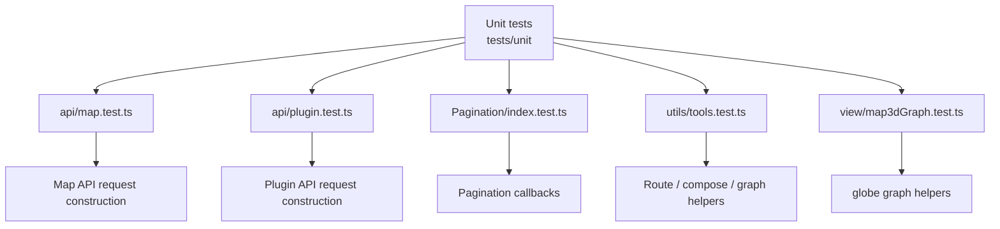
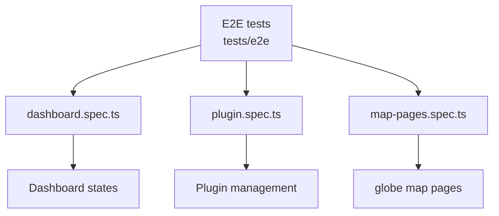

# internet-map-globe 测试覆盖文档

本文档描述 `internet-map-globe/frontend` 当前测试用例覆盖的模块、页面和测试函数。

> 当前 Windows 工作区中的目录可能仍显示为 `internet-map-globe`；CI 和文档按目标目录名 `internet-map-globe` 描述。

## 测试入口

- 单元测试：`pnpm run test:unit`
- E2E 测试：`pnpm run test:e2e`

## 单元测试覆盖图

| 测试文件 | 覆盖模块 | 测试函数 |
| --- | --- | --- |
| `tests/unit/api/map.test.ts` | Map API service | `requests containers with query params` `requests networks with query params` |
| `tests/unit/api/plugin.test.ts` | Plugin API service | `requests installable plugins with query params` `posts plugin install requests as JSON` `posts plugin uninstall requests as JSON` |
| `tests/unit/components/Pagination/index.test.ts` | Pagination component | `calls getData when page size changes` `calls getData when current page changes` |
| `tests/unit/utils/tools.test.ts` | Route helpers | `flattens nested router records into menu items` `finds a route together with its parent chain` `does not build image URLs outside development mode` |
| `tests/unit/utils/tools.test.ts` | Compose conversion | `builds seed nodes and networks from docker compose metadata` `returns empty data for missing compose content` |
| `tests/unit/utils/tools.test.ts` | Graph weighting helpers | `returns router dots ordered by AS transit density` |
| `tests/unit/view/map3dGraph.test.ts` | globe map graph helpers | `builds stable undirected edge keys` `identifies routers and border routers as transit routers` `adds AS highlight nodes near visible satellite-connected routers` |

## E2E 测试覆盖图

| 测试文件 | 覆盖功能模块 | 测试函数 |
| --- | --- | --- |
| `tests/e2e/dashboard.spec.ts` | Dashboard page states | `shows loading state while data is pending` `shows empty state when both tables have no data` `shows error state when an api returns not ok` `shows normal state with nodes and networks` `renders multi-interface nodes and multiple networks` |
| `tests/e2e/plugin.spec.ts` | Plugin management page | `loads plugins, searches by keyword, and sends install/uninstall actions` |
| `tests/e2e/emulator-topology-pages.spec.ts` | Live emulator topology page | `live emulator topology page loads from mocked Docker API data` |
| `tests/e2e/emulator-topology-pages.spec.ts` | Uploaded emulator topology page | `file-based emulator topology page shows compose upload entry` |
