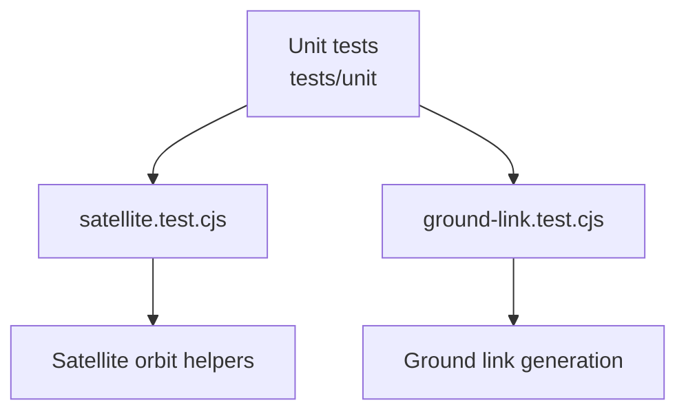
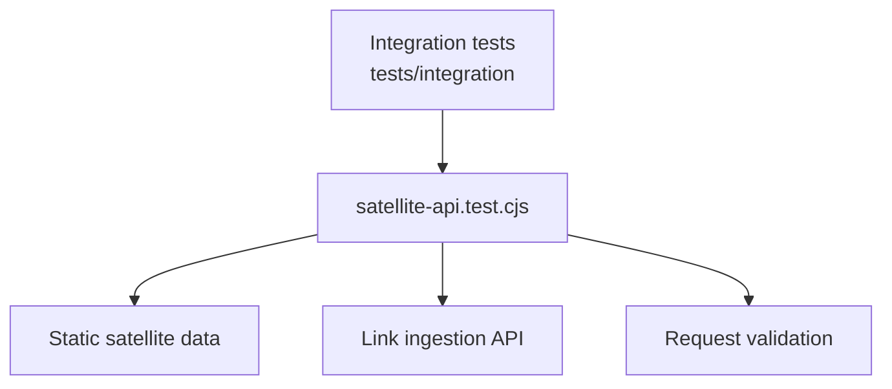

# satellite-emulator-service 测试覆盖文档

本文档描述 `satellite-emulator-service` 当前测试用例覆盖的模块和测试函数。

## 测试入口

- 单元测试：`npm run test:unit`
- 集成测试：`npm run test:integration`

## 单元测试覆盖图

| 测试文件 | 覆盖模块 | 测试函数 |
| --- | --- | --- |
| `tests/unit/satellite.test.cjs` | Satellite orbital helpers | `computes a satellite position with finite coordinates` `computes a positive orbital speed` `generates an orbit polyline with speed metadata` |
| `tests/unit/ground-link.test.cjs` | Ground link generation | `validates satellite positions and ground stations` `creates nearest ground links only for satellites within range` `supports limiting nearest-link generation to selected satellites` |

## 集成测试覆盖图

| 测试文件 | 覆盖模块 | 测试函数 |
| --- | --- | --- |
| `tests/integration/satellite-api.test.cjs` | Static satellite API | `serves static satellite data through the satellite API` |
| `tests/integration/satellite-api.test.cjs` | Link ingestion API | `posts default satellite link file and rejects files outside tmp` `accepts explicit satellite link files inside tmp` |
| `tests/integration/satellite-api.test.cjs` | Request validation | `rejects legacy network link requests without reading a default network file` `rejects malformed link request bodies before reading files` |

