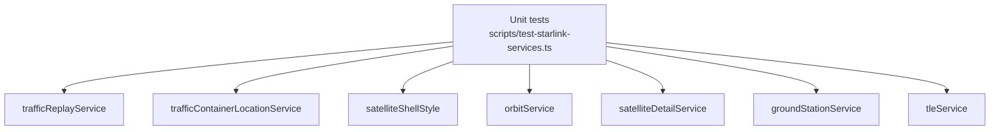
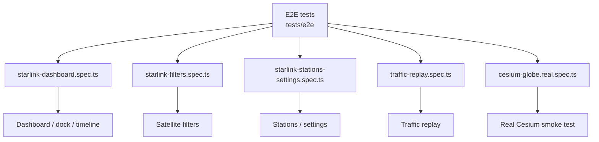

# satellite-emulator 测试覆盖文档

本文档描述 `satellite-emulator/frontend` 当前测试用例覆盖的模块、页面和测试函数。

## 测试入口

- 单元测试：`pnpm run test:unit`
- E2E 测试：`pnpm run test:e2e`

## 单元测试覆盖图

`satellite-emulator/frontend` 的单元测试入口是 `scripts/test-starlink-services.ts`，通过 Node `assert` 直接覆盖 Starlink 相关 service。

| 覆盖模块 | 测试函数 |
| --- | --- |
| `trafficReplayService` | `testCreateReplayEvent` `testTimestampNormalization` `testReplayEventComparison` `testTrafficReplayPlaylist` `testSeekHelpers` |
| `trafficContainerLocationService` | `testTrafficContainerLocations` |
| `satelliteShellStyle` | `testSatelliteShellStyle` |
| `orbitService` | `testOrbitPropagation` |
| `satelliteDetailService` | `testSatelliteDetails` |
| `groundStationService` | `testGroundLinks` |
| `tleService` | `testPlannedOrbitParsing` |

## E2E 测试覆盖图

| 测试文件 | 覆盖功能模块 | 测试函数 |
| --- | --- | --- |
| `tests/e2e/starlink-dashboard.spec.ts` | Dashboard bootstrap / right dock / timeline | `shows the Starlink Shells tab from mocked orbit data` `filters and selects satellites in the Satellites tab` `shows empty state in the Selected tab before a satellite is selected` `searches and selects stations in the Stations tab` `opens Traffic Replay tab, searches container nodes, and submits a mocked packet filter` `opens Settings tab and updates visible controls` `expands Timeline Events and shows mocked link update events in the event list` `records manual TimeEvent entries when applying and resetting system time` `collapses and expands the right dock without losing page navigation` |
| `tests/e2e/starlink-filters.spec.ts` | Satellite filters | `supports inverted text search and clear filters` `supports altitude filter and inverted altitude filter` `supports plane filter, shell-plane linkage, and clearing selected planes` |
| `tests/e2e/starlink-stations-settings.spec.ts` | Stations and settings controls | `supports station select all and invert` `supports selected satellite clear all` `toggles all settings switches` `disables simulation speed while traffic capture is active` |
| `tests/e2e/traffic-replay.spec.ts` | Traffic replay capture and playback | `records only while capture and recording are enabled` `plays, pauses, jumps, seeks, stops, and clears recorded packets` `searches known and packet-discovered container nodes` |
| `tests/e2e/cesium-globe.real.spec.ts` | Real Cesium globe rendering | `initializes the real 3D globe canvas and keeps UI overlays usable` |

