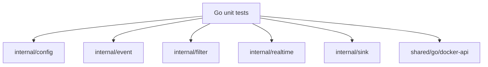

# traffic-observer-service 测试覆盖文档

本文档描述 `traffic-observer-service` 和 `shared/go/docker-api` 当前测试用例覆盖的模块和测试函数。

## 测试入口

- traffic-observer-service：`go test ./...`
- shared/go/docker-api：`go test ./...`

## 单元测试覆盖图

| 测试文件 | 覆盖模块 | 测试函数 |
| --- | --- | --- |
| `internal/config/config_test.go` | Configuration loading | `TestLoadDefaults` `TestLoadOverrides` `TestLoadFallsBackForInvalidDiscoveryConcurrency` |
| `internal/event/event_test.go` | Packet event conversion | `TestFromRawConvertsPacketFields` `TestFromRawNamesUnknownValues` |
| `internal/filter/filter_test.go` | tcpdump-like filter parser | `TestParseEmptyDisablesFilter` `TestParseProtocolDirectionAndQualifiers` `TestParseHostAndPortMatchEitherSide` `TestParseRejectsInvalidExpressions` |
| `internal/realtime/packet_hub_test.go` | Packet WebSocket hub | `TestPacketHubBroadcastsPacketMessages` `TestPacketHubIgnoresUnsupportedValues` |
| `internal/sink/sink_test.go` | Event sink implementations | `TestNewReturnsStdoutSinkWhenURLIsEmpty` `TestNewRejectsInvalidWebSocketURL` `TestWebSocketSinkSendsJSON` |
| `shared/go/docker-api/client_test.go` | Shared Docker API helpers | `TestShortID` |

## E2E 覆盖说明

`traffic-observer-service` 当前没有浏览器 E2E 测试。它的 CI 主要通过 Go 单元测试、eBPF 编译检查、`go vet` 和 Docker build 验证服务可构建性。

