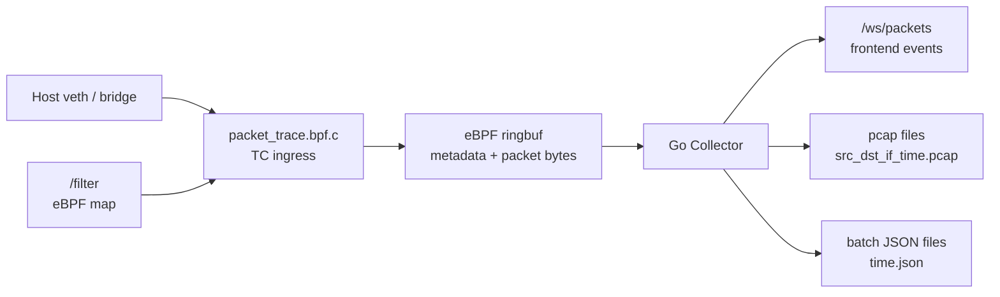
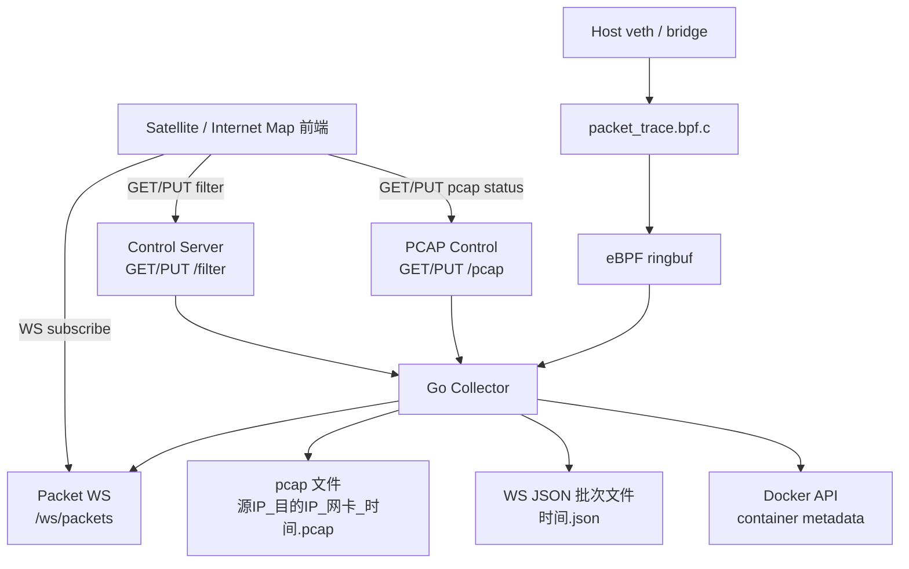

# traffic-observer-service

`traffic-observer-service` 是原 `traffic-observer` 重命名后的服务，负责通过 eBPF 抓取容器虚拟网卡上的 packet metadata，并可按需将原始 packet 保存为 pcap 文件、将前端 WebSocket 事件批量保存为 JSON 文件。

## 职责

- 编译并加载 eBPF 程序。
- attach 到宿主机容器 veth / bridge 等网卡。
- 通过 ringbuf 接收 packet metadata。
- 提供 `/filter` 控制接口。
- 提供 `/pcap` 控制接口，用于开启 / 关闭抓包文件保存并查询状态。
- 提供 `/ws/packets` 给前端订阅实时 packet 事件。
- 可将 eBPF 抓到的原始二层帧保存为 pcap。
- 可将发送给前端的 WebSocket packet event 按批次追加保存为 JSON。

## 数据链路



## eBPF 事件内容

eBPF 程序在 filter 命中后向 ringbuf 提交：

- packet metadata：
  - timestamp
  - host interface index
  - packet length
  - direction
  - Ethernet protocol
  - source / destination MAC
  - IPv4 source / destination
  - IP protocol
  - TCP / UDP source / destination port
  - TCP flags
  - TTL
  - IP total length
- packet bytes：
  - 从二层帧 offset `0` 开始保存
  - 当前最大保存长度：`32768` bytes
  - pcap record 的 `origLen` 仍保留原始 packet length

## 调用关系



## Filter API

`/filter` 控制 eBPF map 中的抓包过滤条件。空字符串表示关闭 eBPF 抓包，`all` 表示抓取所有包。

查询当前 filter：

```bash
curl http://127.0.0.1:19092/filter
```

设置 filter：

```bash
curl -X PUT http://127.0.0.1:19092/filter \
  -H "Content-Type: application/json" \
  -d '{"filter":"icmp"}'
```

关闭抓包：

```bash
curl -X PUT http://127.0.0.1:19092/filter \
  -H "Content-Type: application/json" \
  -d '{"filter":""}'
```

## PCAP / JSON 保存 API

`/pcap` 控制文件保存功能。这个开关不改变 eBPF filter；它只控制“已经被 eBPF filter 命中的 packet 是否写入文件”。

查询保存状态：

```bash
curl http://127.0.0.1:19092/pcap
```

响应示例：

```json
{
  "enabled": true,
  "outputDir": "/data/pcap",
  "currentPcapFile": "/data/pcap/10.150.0.72_10.151.0.72_veth123abc_20260811143022.pcap",
  "currentJsonFile": "/data/pcap/20260811143020.json",
  "packetCount": 10,
  "byteCount": 980,
  "messageCount": 10
}
```

开启保存：

```bash
curl -X PUT http://127.0.0.1:19092/pcap \
  -H "Content-Type: application/json" \
  -d '{"enabled":true}'
```

关闭保存：

```bash
curl -X PUT http://127.0.0.1:19092/pcap \
  -H "Content-Type: application/json" \
  -d '{"enabled":false}'
```

### 文件输出规则

开启保存后会生成两类文件。

1. pcap 文件

文件名：

```text
源IP_目的IP_网卡_年月日时分秒.pcap
```

示例：

```text
10.150.0.72_10.151.0.72_veth123abc_20260811143022.pcap
```

说明：

- pcap 保存的是 eBPF 抓到的原始二层帧 bytes。
- pcap 文件在本次保存期间第一次收到 packet 时创建。
- 当前实现每次保存批次只维护一个 pcap 文件；文件名使用该批次第一个 packet 的源 IP、目的 IP、网卡和时间。

2. JSON 批次文件

文件名：

```text
年月日时分秒.json
```

示例：

```text
20260811143020.json
```

说明：

- JSON 保存的是发送给前端 `/ws/packets` 的同一份 `PacketMessage`。
- 一次从开启保存到关闭保存，视为一个批次。
- 再次开启保存时会创建新的 JSON 文件。
- 文件内容是 JSON array。

## 日志时区

Go 标准库 `log` 使用进程 local time。容器默认通常是 UTC，因此日志可能比北京时间少 8 小时。

服务启动时会读取：

```bash
TRAFFIC_LOG_TIMEZONE=Asia/Shanghai
```

默认值就是 `Asia/Shanghai`。如果该时区加载失败，会 fallback 到 UTC+8 固定时区。

## Docker

- 目录：`traffic-observer-service/`
- 容器名：`traffic-observer-service`
- 默认 control / WS 地址：`:19092`
- 运行模式：`privileged: true`、`pid: host`、`network_mode: host`
- 因为使用 host network，Go 后端监听 `:19092` 时会直接暴露为宿主机 `19092`，不需要也不应该再配置 compose `ports` 映射。
- pcap / JSON 默认输出目录：`/data/pcap`
- compose 默认挂载到宿主机：`./traffic-observer-service/pcap:/data/pcap`

常用环境变量：

| 变量 | 默认值 | 说明 |
| --- | --- | --- |
| `TRAFFIC_FILTER` | 空字符串 | 初始 eBPF filter，空表示不抓包 |
| `TRAFFIC_CONTROL_ADDR` | `:19092` | control API 与 packet WS 监听地址 |
| `TRAFFIC_PCAP_ENABLED` | `false` | 是否启动时默认开启文件保存 |
| `TRAFFIC_PCAP_OUTPUT_DIR` | `/data/pcap` | pcap / JSON 输出目录 |
| `TRAFFIC_LOG_TIMEZONE` | `Asia/Shanghai` | Go 标准日志时区 |
| `TRAFFIC_ONLY_SEED_CONTAINERS` | `true` | 是否只发现 SEED 容器 veth |
| `TRAFFIC_DISCOVERY_CONCURRENCY` | `32` | 容器网卡发现并发数 |

## 测试覆盖

Mermaid 测试覆盖图见 [traffic-observer-service-testing.md](./test/traffic-observer-service-testing.md)。
