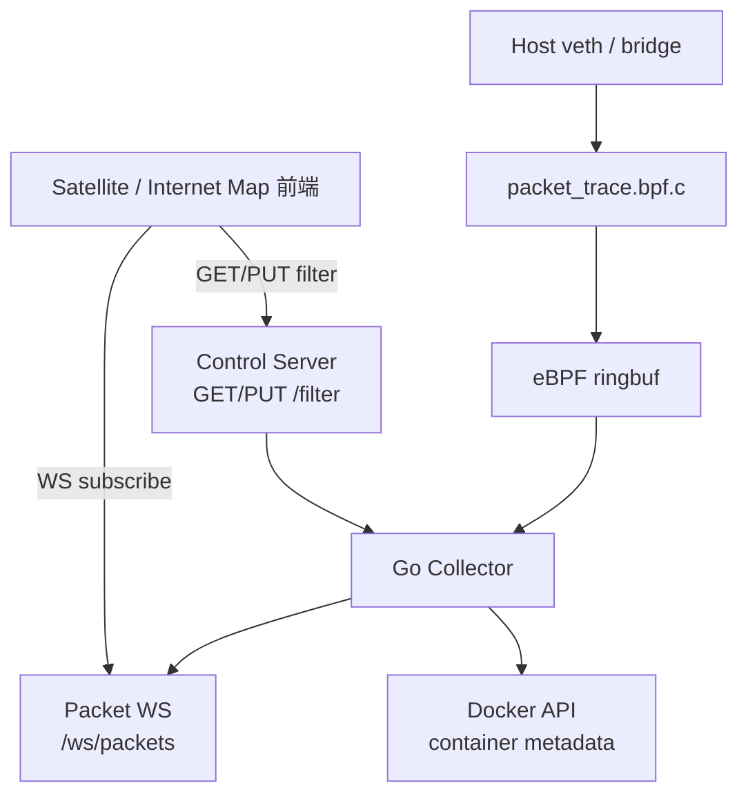

# traffic-observer-service

`traffic-observer-service` 是原 `traffic-observer` 重命名后的服务，负责通过 eBPF 抓取容器虚拟网卡上的 packet metadata。

## 职责

- 编译并加载 eBPF 程序。
- attach 到宿主机容器 veth / bridge 等网卡。
- 通过 ringbuf 接收 packet metadata。
- 提供 `/filter` 控制接口。
- 提供 `/ws/packets` 给前端订阅实时 packet 事件。

## 调用关系

## Docker

- 目录：`traffic-observer-service/`
- 容器名：`traffic-observer-service`
- 默认 control / WS 地址：`:19092`
- 运行模式：`privileged: true`、`pid: host`、`network_mode: host`
- 因为使用 host network，Go 后端监听 `:19092` 时会直接暴露为宿主机 `19092`，不需要也不应该再配置 compose `ports` 映射。
